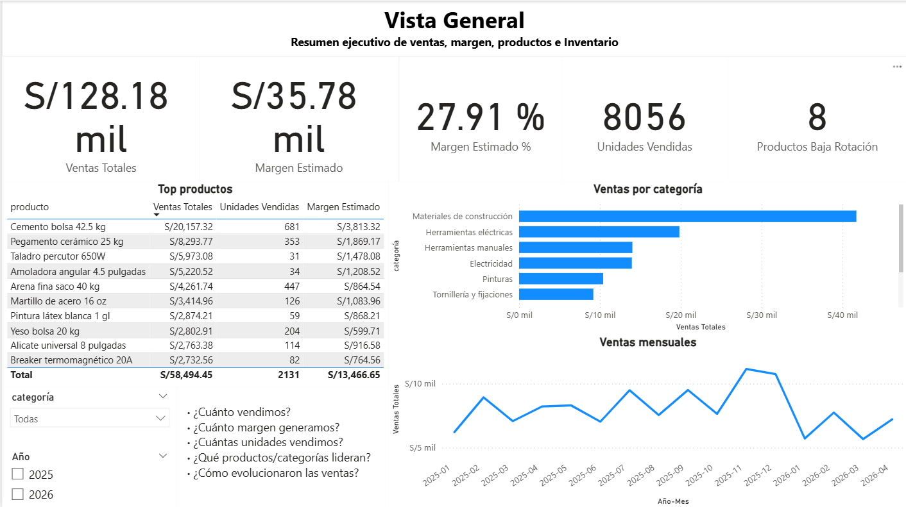

# Sistema de Business Intelligence – Ferretería

Dashboard funcional de Business Intelligence para monitorear ventas, inventario, margen y desempeño de productos en una ferretería. El proyecto usa un dataset sintético pero coherente con la operación de una tienda real, consultas SQL de validación y un tablero final desarrollado en Power BI.

## Estado

Proyecto completo para entrega en GitHub.

Fases desarrolladas:

- Fase 1: dataset sintético de productos y ventas.
- Fase 2: scripts SQL de schema, validación y KPIs.
- Fase 3: modelo Power BI, relaciones, calendario y medidas DAX.
- Fase 4: dashboard con páginas funcionales.
- Fase 5: insights, QA y screenshots.
- Fase 6: documentación final y publicación en GitHub.

## Objetivo

Diseñar un sistema de análisis que permita a gerencia o administración de tienda responder preguntas clave:

- ¿Cuánto vendemos?
- ¿Qué margen generamos?
- ¿Qué productos y categorías lideran?
- ¿Cómo evolucionan las ventas en el tiempo?
- ¿Qué productos tienen baja rotación?
- ¿Dónde se concentra el valor del inventario?

## Stack

- **CSV / Excel:** almacenamiento base del dataset.
- **SQL / SQLite:** creación de schema, validaciones y consultas KPI.
- **Power BI Desktop:** modelo semántico, medidas DAX y dashboard.
- **Power Query:** importación y preparación de datos.
- **Git / GitHub:** control de versiones y publicación del proyecto.

## Dataset

El dataset fue generado de forma sintética para simular una ferretería con variedad de productos, categorías, precios, costos, stock y ventas históricas.

| Tabla | Archivo | Descripción |
|---|---|---|
| Productos | `data/raw/productos.csv` | Catálogo de productos con categoría, costo y stock actual. |
| Ventas | `data/raw/ventas.csv` | Transacciones de venta con fecha, producto, cantidad, precio unitario y total. |

Volumen del dataset:

- 72 productos.
- 1,800 registros de ventas.
- 9 categorías.
- Periodo: enero 2025 a abril 2026.

Documentos relacionados:

- `docs/diccionario-datos.md`
- `docs/resumen-dataset.md`

## KPIs Principales

Los KPIs fueron calculados en SQL y replicados como medidas DAX en Power BI.

| KPI | Resultado |
|---|---:|
| Ventas totales | S/ 128,182.96 |
| Unidades vendidas | 8,056 |
| Transacciones | 1,800 |
| Margen estimado | S/ 35,775.12 |
| Margen estimado % | 27.91% |
| Productos de baja rotación | 8 |
| Stock actual | 6,039 |
| Valor de inventario | S/ 49,960.00 |

## Dashboard Power BI

Archivo principal:

- `powerbi/ferreteria_bi.pbix`

Páginas del dashboard:

1. **Validación KPIs:** comparación de medidas principales contra los resultados esperados.
2. **Vista General:** resumen ejecutivo de ventas, margen, productos e inventario.
3. **Ventas:** evolución temporal, ticket promedio, margen mensual y resumen por periodo.
4. **Productos:** ranking de productos, ventas por categoría y detalle de desempeño.
5. **Inventario:** stock, valor de inventario, rotación y productos críticos.

Documentos relacionados:

- `docs/cierre-final.md`
- `docs/modelo-powerbi.md`
- `docs/medidas-dax.md`
- `docs/dashboard-powerbi.md`

## Capturas

| Página | Screenshot |
|---|---|
| Validación KPIs | `screenshots/01_validacion_kpis.png` |
| Vista General | `screenshots/02_vista_general.png` |
| Ventas | `screenshots/03_ventas.png` |
| Productos | `screenshots/04_productos.png` |
| Inventario | `screenshots/05_inventario.png` |

Vista General:



## Insights Principales

- **Materiales de construcción** concentra el mayor volumen de ventas y valor de negocio.
- **Cemento bolsa 42.5 kg** lidera el ranking de ventas y margen estimado.
- Las ventas muestran una tendencia descendente hacia los últimos meses del periodo analizado, lo que sugiere revisar estacionalidad, demanda y abastecimiento.
- Existen productos de baja rotación que requieren acciones comerciales o revisión de stock.
- El inventario está concentrado en categorías de alto valor, por lo que conviene monitorear rotación y reposición para evitar capital inmovilizado.

Más detalle:

- `docs/insights.md`
- `docs/qa-checklist.md`

## Estructura del Repositorio

```text
.
├── data/
│   └── raw/
│       ├── productos.csv
│       └── ventas.csv
├── docs/
│   ├── dashboard-powerbi.md
│   ├── cierre-final.md
│   ├── diccionario-datos.md
│   ├── documento-maestro.md
│   ├── insights.md
│   ├── medidas-dax.md
│   ├── modelo-powerbi.md
│   ├── qa-checklist.md
│   ├── resultados-sql.md
│   ├── resumen-dataset.md
│   └── resumen-sql.md
├── powerbi/
│   └── ferreteria_bi.pbix
├── screenshots/
│   ├── 01_validacion_kpis.png
│   ├── 02_vista_general.png
│   ├── 03_ventas.png
│   ├── 04_productos.png
│   └── 05_inventario.png
├── scripts/
│   └── validar_sql.py
├── sql/
│   ├── 01_schema.sql
│   ├── 02_validaciones.sql
│   └── 03_kpis.sql
└── README.md
```

## Cómo Revisar el Proyecto

1. Abrir `powerbi/ferreteria_bi.pbix` con Power BI Desktop.
2. Revisar las páginas del dashboard: Validación KPIs, Vista General, Ventas, Productos e Inventario.
3. Consultar los screenshots en `screenshots/` si no se tiene Power BI instalado.
4. Revisar los insights en `docs/insights.md`.
5. Ejecutar la validación SQL con:

```bash
python scripts/validar_sql.py
```

## Entregables

- Dataset: `data/raw/productos.csv` y `data/raw/ventas.csv`.
- SQL: scripts en `sql/`.
- Dashboard: `powerbi/ferreteria_bi.pbix`.
- Screenshots: carpeta `screenshots/`.
- Documentación: `README.md` y carpeta `docs/`.

## Resultado

Dashboard funcional con insights reales de negocio para una ferretería, listo para revisión en Power BI y presentación como proyecto de portafolio.
